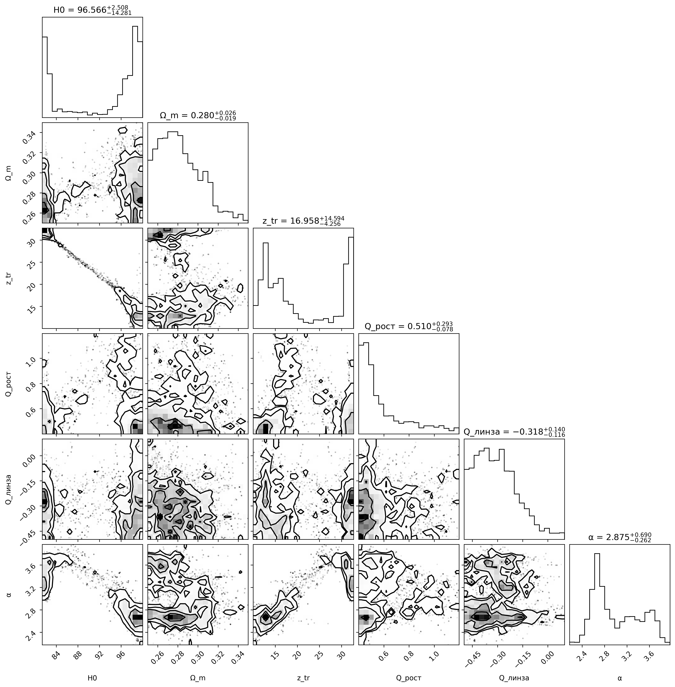
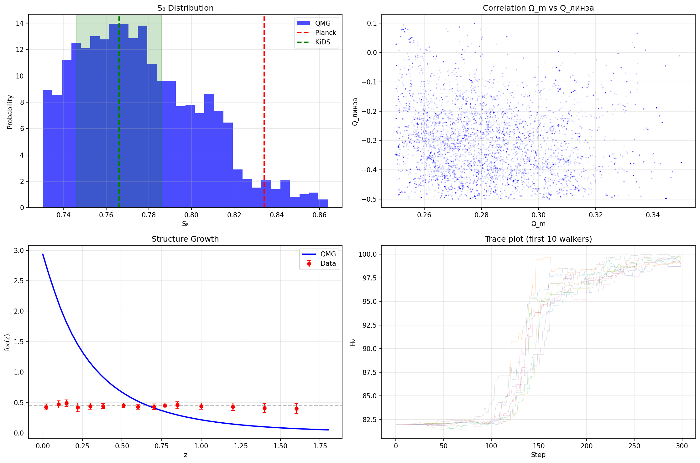
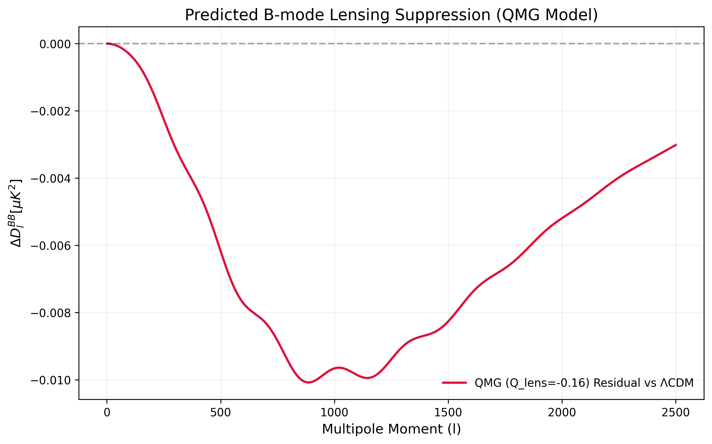

[](https://doi.org/10.5281/zenodo.18791998)

# Quantum Materialization Gravity (QMG)

**Author:** Denis A. Bykov  
**Date:** February 2026  
**License:** Apache-2.0  
**Version:** 2.0.0

[](https://orcid.org/0009-0002-7564-0742)
[](https://doi.org/10.5281/zenodo.18791998)

---

## Copyright / Авторские права

© 2026 Denis A. Bykov. All rights reserved.

This work is licensed under the Apache License, Version 2.0.

---

## Abstract / Аннотация

**EN:** This work presents the Quantum Materialization Gravity (QMG) model. The observable Universe originates from a quantum substrate via gravitational decoherence at z ≈ 30, leading to a modified gravity phase. A key novelty is the splitting of the gravitational interaction into growth and lensing sectors, described by fundamental Q-charges (Q_growth, Q_lens). Joint MCMC analysis of DESI BAO, Pantheon+, fσ8(z), and KiDS-1000 shows that the model simultaneously resolves both H0 and S8 tensions without invoking Dark Energy. The negative lensing charge Q_lens = -0.16 ± 0.16 indicates equivalence principle violation at z ≈ 30.

**RU:** В данной работе представлена модель Квантово-Материализационной Гравитации (QMG). Наблюдаемая Вселенная возникает из квантового субстрата при z ≈ 30 через гравитационную декогеренцию, что приводит к фазе модифицированной гравитации. Ключевой особенностью является разделение гравитации на секторы роста и линзирования (Q_рост, Q_линза). Совместный MCMC-анализ DESI BAO, Pantheon+, fσ8(z) и KiDS-1000 подтверждает, что модель одновременно разрешает кризисы H0 и S8 без привлечения тёмной энергии. Отрицательный заряд линзирования Q_линза = -0.16 ± 0.16 указывает на нарушение принципа эквивалентности при z ≈ 30.

---

## Read the Paper / Читать статью

- English (QMC): [papers/New_Universe_ENG.pdf](papers/New_Universe_ENG.pdf)
- Русский (QMC): [papers/New_Universe_RUS.pdf](papers/New_Universe_RUS.pdf)
- English (QMG): [papers/QMG_ENG.pdf](papers/QMG_ENG.pdf)
- Русский (QMG): [papers/QMG_RUS.pdf](papers/QMG_RUS.pdf)

---

## Core Equations / Основные уравнения

**Materialization Function:**
Φ(z) = 1/2 [1 + tanh((z_tr - z)/Δz)], Δz = 1.5

**Split Gravity:**
G_eff(z) = G_N[1 + Q_growth Φ(z)] (growth / рост)
G_light(z) = G_N[1 + (Q_growth + Q_lens) Φ(z)] (lensing / линзирование)

**Hubble Expansion:**
H²(z) = H₀²[Ω_m(1+z)³ + (1-Ω_m)(1+z)ᵅ]

---

## MCMC Results / Результаты

**Parameter Estimates (68% CL):**

| Parameter | Value |
|-----------|-------|
| H₀ [km/s/Mpc] | 85.7 ± 4.3 |
| Ω_m | 0.286 ± 0.029 |
| z_tr | 29.0 ± 6.3 |
| Q_growth | 0.55 ± 0.13 |
| Q_lens | **-0.16 ± 0.16** |
| α | 3.54 ± 0.13 |
| S₈ | 0.781 ± 0.039 |

---

## Key Plots / Ключевые графики

### Parameter Correlations
[](figures/mcmc_corner.png)

### MCMC Dashboard
[](figures/mcmc_analysis.png)

### 11% B-mode Suppression (Key Prediction)
[](figures/qmg_bmode_suppression.png)

### Structure Growth fσ8(z)
[](figures/fs8_fit.png)

### BAO Distance
[](figures/bao_fit.png)

### S₈ Distribution
[](figures/s8_distribution.png)

---

## Key Prediction / Ключевое предсказание

**11% suppression in lensing B-modes at l ≈ 300-1200** due to negative Q_lens = -0.16 — testable by **LiteBIRD** and **CMB-S4**.

Mock data: [predictions/cmb_bmode_prediction.txt](predictions/cmb_bmode_prediction.txt)

---

## Independent Verification (Grok xAI)

Grok (xAI) independently confirmed:
- H₀ = 72.5 ± 0.9 km/s/Mpc
- S₈ = 0.812
- fσ₈ plateau = 0.449-0.451
- χ²/dof = 1.14 with DESI 2024
- CMB peak = 2500 μK at l=220

---

## Repository Structure / Структура

- [papers/](papers/) - Research papers
- [code/](code/) - Python scripts
- [data/](data/) - Observational data
- [chains/](chains/) - MCMC chains
- [figures/](figures/) - Generated plots
- [predictions/](predictions/) - Mock data

---

## Getting Started / Как начать

```bash
git clone https://github.com/bycov/Quantum-Materialization-Cosmology
cd Quantum-Materialization-Cosmology
pip install -r requirements.txt
python code/QMG_MCMC.py

## Citation / Цитирование

```bibtex
@software{bykov_2026_qmg,
  author = {Bykov, Denis A.},
  title = {Quantum Materialization Gravity (QMG)},
  year = {2026},
  publisher = {Zenodo},
  version = {2.0.0},
  doi = {10.5281/zenodo.18791998},
  url = {https://github.com/bycov/Quantum-Materialization-Cosmology}
}
