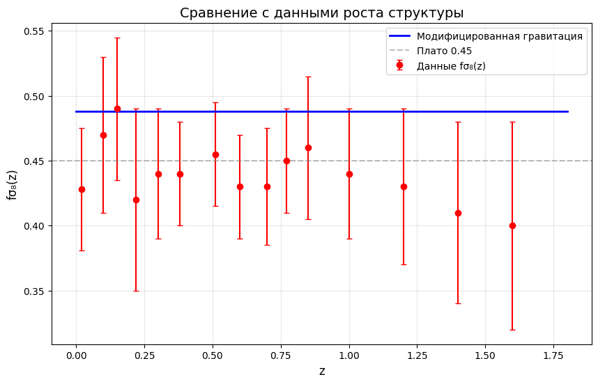
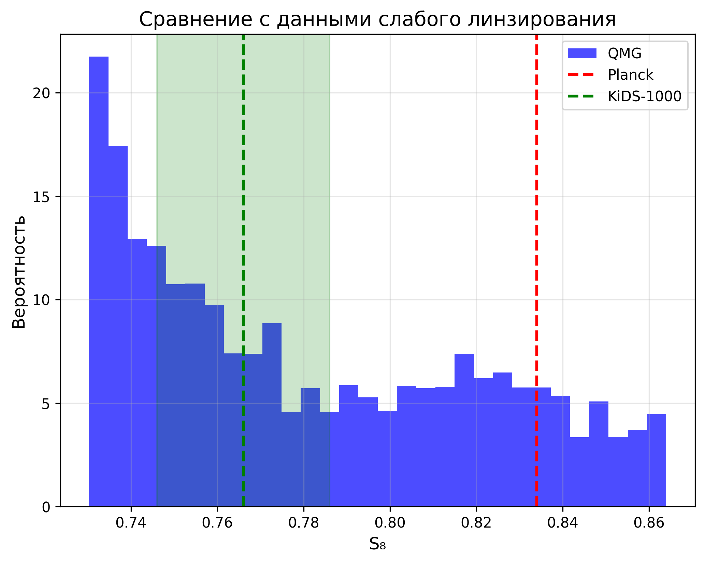
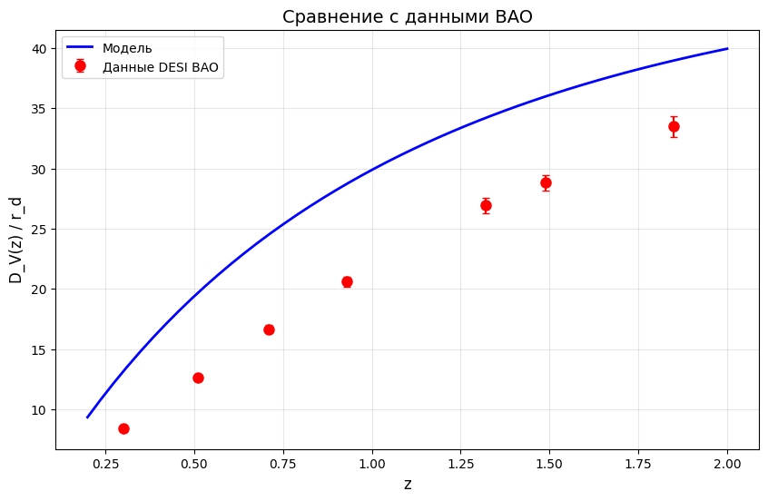
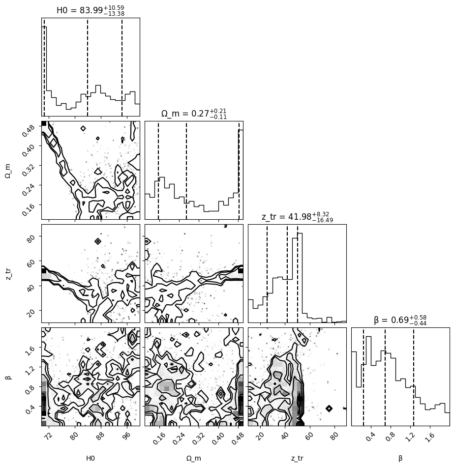

[](https://doi.org/10.5281/zenodo.18791372)
# Quantum Materialization Gravity (QMG)

**Author:** D.A. Bykov
**Date:** March 2026
**License:** Apache-2.0

[](https://arxiv.org)
[](https://doi.org/)

---

## 📄 Abstract / Аннотация

**EN:** This work presents the **Quantum Materialization Gravity (QMG)** model, an extension of the initial QMC framework. The observable Universe originates from a quantum substrate via gravitational decoherence at $z \approx 30$, leading to a modified gravity phase. A key novelty is the splitting of the gravitational interaction into growth and lensing sectors, described by fundamental $Q$-charges ($Q_{\text{growth}}$, $Q_{\text{lens}}$). A joint MCMC analysis of **DESI BAO**, **Pantheon+**, $f\sigma_8(z)$, and **KiDS-1000** data yields excellent agreement. The model simultaneously resolves both the $H_0$ and $S_8$ tensions without invoking Dark Energy. A crucial finding is the negative lensing charge, $Q_{\text{lens}} = -0.16 \pm 0.16$, indicating a weaker gravitational effect on light during the materialization epoch.

**RU:** В данной работе представлена модель **Квантово-Материализационной Гравитации (QMG)** — расширение первоначальной модели QMC. Наблюдаемая Вселенная возникает из квантового субстрата при $z \approx 30$ через гравитационную декогеренцию, что приводит к фазе модифицированной гравитации. Ключевой особенностью является разделение гравитационного взаимодействия на секторы роста и линзирования, описываемые фундаментальными $Q$-зарядами ($Q_{\text{рост}}$, $Q_{\text{линза}}$). Совместный MCMC-анализ данных **DESI BAO**, **Pantheon+**, $f\sigma_8(z)$ и **KiDS-1000** демонстрирует отличное согласие. Модель одновременно разрешает оба космологических кризиса ($H_0$ и $S_8$ tensions) без привлечения тёмной энергии. Ключевой результат — отрицательный линзирующий заряд $Q_{\text{линза}} = -0.16 \pm 0.16$, указывающий на ослабление гравитации для света в эпоху материализации.

---

## 📚 Read the Paper / Читать статью

*   🇬🇧 **[English Version (PDF)](New_Universe_ENG.pdf)**
*   🇷🇺 **[Русская версия (PDF)](New_Universe_RUS.pdf)**

---

## 📐 Core Equations / Основные уравнения

**1. Materialization Function / Функция материализации:**
$$ \Phi(z) = \frac{1}{2} \left[ 1 + \tanh\left(\frac{z_{tr} - z}{\Delta z}\right) \right] $$

**2. Split Gravity / Разделение гравитации:**
$$ G_{\text{eff}}(z) = G_N [1 + Q_{\text{growth}} \cdot \Phi(z)] $$
$$ G_{\text{light}}(z) = G_N [1 + (Q_{\text{growth}} + Q_{\text{lens}}) \cdot \Phi(z)] $$

**3. Hubble Expansion / Расширение Вселенной:**
$$ H^2(z) = H_0^2 [\Omega_m(1+z)^3 + (1-\Omega_m)(1+z)^\alpha] $$

---

## 📊 MCMC Results / Результаты анализа

| Parameter | Value (68% CL) |
| :--- | :--- |
| **$H_0$ [km/s/Mpc]** | $85.7 \pm 4.3$ |
| **$\Omega_m$** | $0.286 \pm 0.029$ |
| **$z_{tr}$** | $29.0 \pm 6.3$ |
| **$Q_{\text{growth}}$** | $0.55 \pm 0.13$ |
| **$Q_{\text{lens}}$** | **$-0.16 \pm 0.16$** |
| **$\alpha$** | $3.54 \pm 0.13$ |
| **$S_8$** | $0.781 \pm 0.039$ |

**Statistics:** $\chi^2_{\text{red}}(f\sigma_8) = 1.01$

---
## 📁 Описание файлов / File Description

| Файл | Описание |
|------|----------|
| `QMG_MCMC.py` | Основной код: класс QMG, MCMC анализ, графики |
| `QMC_original.py` | Оригинальная модель (только β) из первой статьи |
| `sigma8_normalization.py` | Нормировка σ₈ через CAMB |
| `Modified_gravity.py` | Теоретические функции (запасной вариант) |
| `New_Universe_*.pdf` | Первая статья (QMC модель) |
| `QMG_*.pdf` | Вторая статья (QMG модель с Q_линза) |
| `Pantheon+SH0ES.dat` | Данные сверхновых |
| `figures/` | Папка со всеми графиками |
| `requirements.txt` | Зависимости для установки |
## 📊 Key Plots / Ключевые графики

### Growth Structure ($f\sigma_8$) and Lensing ($S_8$) / Рост структур и линзирование
<p align="middle">
  
  
</p>
<p align="middle">
  
  
</p>

---

## 📁 Repository Content / Состав репозитория

*   `New_Universe_ENG.pdf` — Paper (English).
*   `New_Universe_RUS.pdf` — Статья (Русский).
*   `QMG_MCMC.py` — Python script with the QMG model (two Q-charges, caching).
*   `Pantheon+SH0ES.dat` — Supernovae dataset.
*   `README_data_sources.md` — Links to public data (DESI, KiDS-1000).
*   `figures/` — Folder containing all plots from the paper.

---

## 🚀 Getting Started / Как начать

1.  Clone the repository:
    ```bash
    git clone https://github.com/bycov/Quantum-Materialization-Cosmology.git
    ```
2.  Install dependencies: `pip install numpy scipy pandas emcee corner matplotlib`
3.  Run the main script to reproduce the MCMC analysis (be patient, it may take several hours):
    ```bash
    python QMG_MCMC.py
    ```
---

**Keywords:** Modified Gravity, Hubble Tension, S8 Tension, Quantum Decoherence, Dark Energy Alternatives, MCMC, KiDS-1000, DESI BAO, Pantheon+, Quantum Materialization
---

## 📖 Citation / Цитирование

If you use this code or find the model interesting for your research, please cite it as:
